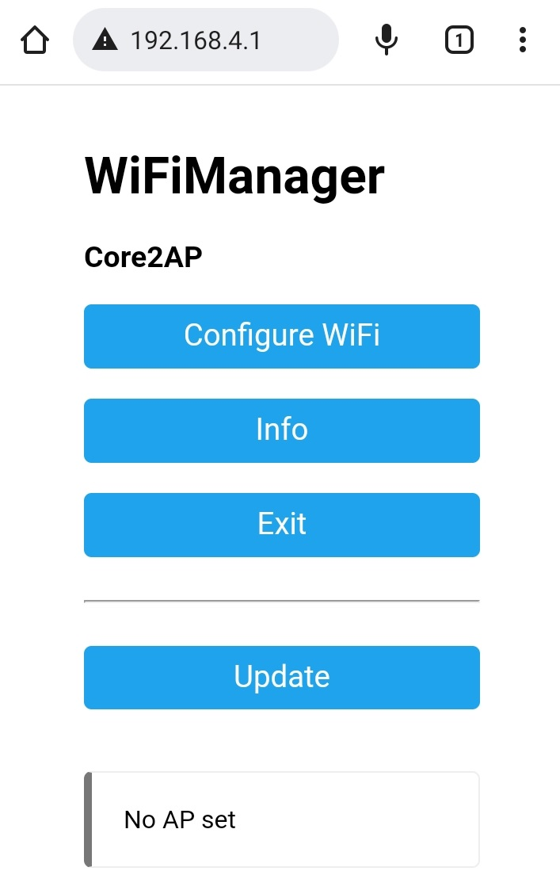

# Plugin jeedisplay pour Jeedom

    Ce plugin permet l'affichage d'informations en provenance de Jeedom ainsi que le déclenchement de scénarios.

        Affichage sur un module M5Core2 basé sur un ESP32

## 1. Configuration du plugin

    Rien de particulier dans la configuration de ce plugin.

## 2. Configuration de l'équipement

    Pour utiliser le plugin il est nécessaire de créer un virtuel qui va contenir les informations qui seront envoyées au module d'affichage.
    On peut également créer des scénarios qui seront activés par le module d'affichage.

    Par exemple, création d'un virtuel avec une consigne température et deux scénarios qui permettront d'augmenter ou de diminuer cette consigne.

## 3. Programmation du module

    Sous Windows, il faut tout d'abord installer les outils nécessaires à la programmation du module

    Installer Python ( https://www.python.org ) sans oublier de cocher Path 

    Lancer l'invite de commandes sous Windows

    Installer PySerial avec la commande
	    python -m pip install pyserial
    Installer esptool avec la commande
	    python -m pip install esptool
    Installer setuptools avec la commande 
	    python -m pip install setuptools

    Installer le firmware du module

    Copier le répertoire module du plugin de Jeedom vers Windows, se positionner dans le répertoire copié puis lancer les commandes

    python esptool.py --chip esp32 --port "COM3" --baud 460800 --before default_reset --after hard_reset write_flash -z --flash_mode dio --flash_freq 40m --flash_size detect 0x1000 bootloader_dio_40m.bin 0x8000 partitions.bin 0xe000 boot_app0.bin 0x10000 firmware.bin

    python esptool.py --chip esp32 --port "COM3" --baud 460800 --before default_reset --after hard_reset write_flash --flash_mode keep --flash_freq 40m --flash_size 4MB 0x290000 spiffs.bin

## 4. Premier démarrage du module

    Au premier démarrage du Wifi, le module se met en attente de connexion WIFI.
    
    

    Il crée un réseau WIFI nommé Core2AP sur lequel il faut se connecter avec un smartphone par exemple ou tout autre
    appareil capable de se connecter au WIFI. Quand la connexion WIFI est établie, il faut naviguer à l'adresse 192.168.4.1 pour accéder à la page Web de
    configuration du WIFI.

    

    Cliquez sur "Configure WIFI" pour choisir un réseau Wifi sur lequel le module se connectera.

    