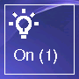

# Plugin jeedisplay pour Jeedom

    Ce plugin permet l'affichage d'informations en provenance de Jeedom ainsi que le déclenchement de scénarios.

        Affichage sur un module M5Core2 basé sur un ESP32

## 1. Configuration du plugin

    Rien de particulier dans la configuration de ce plugin.

## 2. Configuration de l'équipement

    Pour utiliser le plugin il est nécessaire de créer un virtuel qui va contenir les informations qui seront envoyées 
    au module d'affichage. On peut également créer des scénarios qui seront activés par le module d'affichage.

    Par exemple, création d'un virtuel avec une consigne température et deux scénarios qui permettront d'augmenter ou de 
    diminuer cette consigne.

    La configuration de l'équipement permet de choisir un virtuel qui devra contenir les informations qui seront envoyées au module.
    Il permet également de configurer l'adresse IP du module.

## 3. Programmation du module

    Sous Windows, il faut tout d'abord installer les outils nécessaires à la programmation du module

    Installer Python ( https://www.python.org ) sans oublier de cocher Path 

    Lancer l'invite de commandes sous Windows

    Installer PySerial avec la commande
	    python -m pip install pyserial
    Installer esptool avec la commande
	    python -m pip install esptool
    Installer setuptools avec la commande 
	    python -m pip install setuptools

    Installer le firmware du module

    Copier le répertoire module du plugin de Jeedom vers Windows, se positionner dans le répertoire copié puis lancer les commandes

    python esptool.py --chip esp32 --port "COM3" --baud 460800 --before default_reset --after hard_reset write_flash -z --flash_mode dio --flash_freq 40m --flash_size detect 0x1000 bootloader_dio_40m.bin 0x8000 partitions.bin 0xe000 boot_app0.bin 0x10000 firmware.bin

    python esptool.py --chip esp32 --port "COM3" --baud 460800 --before default_reset --after hard_reset write_flash --flash_mode keep --flash_freq 40m --flash_size 4MB 0x290000 spiffs.bin

## 4. Premier démarrage du module

    Au premier démarrage du Wifi, le module se met en attente de connexion WIFI.
    


    Il crée un réseau WIFI nommé Core2AP sur lequel il faut se connecter avec un smartphone par exemple ou tout autre
    appareil capable de se connecter au WIFI. Quand la connexion WIFI est établie, il faut naviguer à l'adresse 192.168.4.1 
    pour accéder à la page Web de configuration du WIFI.


    Cliquez sur "Configure WIFI" pour choisir un réseau Wifi sur lequel le module se connectera. L'adresse IP devra être fixée sur le routeur.

## 5. Site Web du module

    La gestion du module s'effectue via son site Web, pour cela naviguez sur l'adresse attribuée au module ( cette adresse 
        s'affiche au démarrage du module)
    
    On retrouve 4 onglets sur la page Web du module. Acceuil, Répertoire, Actions et Statut.

## 5.1 Onglet Accueil

    Comme son nom l'indique, c'est le module d'accueil, aucunce action n'est possible sur cet onglet.

## 5.2 Onglet Répertoire

    Cet onglet permet d'afficher les fichiers contenus sur la partition SPIFFS du module, il permet le téléversement de fichiers, 
    la suppression et le renommage.

## 5.3 Onglet Actions

    Cet onglet permet de réinialiser les paramètres du WIFI, au prochain démarrage du module ces paramètres seront redemandés.
    Notez que si le module ne parvient pas à se connecter au WIFI, il offre également la possibilité d'introduire de nouveaux
        paramètres.

## 5.4 Onglet Statut

    Cet onglet affiche quelques informations concernant le module.

## 6 Configuration de l'affichage

    Un fichier important qui devra être téléverser sur le module est le fichier display.json, c'est lui qui permet de configurer 
    l'affichage du module. 

    Le module permet l'affichage de panneaux différents et permet évidemment de voyager d'un panneau à l'autre.

## 6.1 Affichage de la barre de statut

    Voici un code complet qui permet d'afficher toutes les informations disponibles sur le module. Avant l'affichage de la barre 
    de statut, on remarque un paramètre "defaultPanel" qui spécifie le panneau qui sera affiché au démarrage du module, 
    ici "Panel0".

    La barre de statut est configurée en "statusBar", tout d'abord sa poisition "top" ou "bottom" et ensuite les objets qui la compose.
    Chaque objet doit contenir un paramètre "x" qui indique la position de l'objet dans la barre de statut.

    Objet "acin". Indique si le module est connecté électriquement ou pas
    Objet "batteryLevel". Indique le niveau de la batterie
    Objet "time". Indique l'heure ( récupérée sur le Web au démarrage du module )
    Objet "coreTemperature". Indique la température du CPU
    Objet "wifiQuality". Indique la qualité de la connexion WIFI
    Objet "connections". Indique le nombre de clients connectés sur le module


```json
{
  "defaultPanel": "panel0",
  "statusBar": {
    "position": "top",
    "objects": [
      {
        "name": "acin",
        "x": 4
      },
      {
        "name": "batteryLevel",
        "x": 20
      },
      {
        "name": "time",
        "x": 230
      },
      {
        "name": "coreTemperature",
        "x": 70
      },
      {
        "name": "wifiQuality",
        "x": 290
      },
      {
        "name": "connections",
        "x": 304
      }
    ]
  }
}
```
## 6.2 Affichage d'un panneau

    On énumère une liste de panneaux en indiquant leur nom "name" et leur fond d'écran "background".

    Le module gère les informations de glissement sur l'écran, on indique 
        le sens du glissement "direction" : "left"|"right"|"up"|"down"
        et l'action qui sera effectuée "action" : "panel" affichage d'un autre panel de nom "value" : "panel4"|"panel1" dans l'exemple

    On indique également la liste des objets qui composent le panneau "objects"

```json 
{
  "panels": [
    {
      "name": "panel0",
      "background": "/fond.jpg",    
      "swipes": [
        {
          "direction": "left",
          "action": "panel",
          "value": "panel4"
        },
        {
          "direction": "right",
          "action": "panel",
          "value": "panel1"
        }
      ],
      "objects": [
        {
          "name": "button",
          "x": 20,
          "y": 45,
          "w": 80,
          "h": 80,
          "icon": "/tools.bmp",
          "action": "panel",
          "value": "panel1"
        }
      ]
    }
  ]
}

```

## 6.2.1 Objet "button"



    L'exemple suivant permet d'afficher un bouton avec une image bulboff.bmp et un label Off si aucune lumière n'est allumée,
    une image bulbon.bmp et un label On(x) x indiquant le nombre de lumières allumées. Le bouton donne accès à un panel qui donne
    l'état de toutes les lumières.

    Les différents paramètres de l'objet button

    "name": "button". Indique le type de l'objet
    "x": 220. Position en X
    "y": 45. Position en Y
    "w": 80. Largeur du bouton
    "h": 80. Hauteur du bouton
    "icon": "/bulbon.bmp". L'image qui sera affichée dans le coin supérieur haut du bouton
    "idValue": 4370. Id Jeedom de la commande définie dans le virtuel qui sera affichée ici
    "label": "On (#value#)". Formatage de l'affichage de la valeur
    "action": "panel". Action à effectuer sur appui du bouton. Ici "panel" changement de panneau
    "value": "panel3". Nom du nouveau panel à afficher
    "idCondition": 4370. Id Jeedom de la commande qui permettra de changer l'affichage en fonction de la valeur de la condition
    "conditions": []. Liste des conditions
        "value": "0". Valeur de la commande
        "label": "Off". Changement de label 
        "icon": "/bulboff.bmp"
```json
{
    "name": "button",
    "x": 220,
    "y": 45,
    "w": 80,
    "h": 80,
    "icon": "/bulbon.bmp",
    "idValue": 4370,
    "label": "On (#value#)",
    "action": "panel",
    "value": "panel3",
    "idCondition": 4370,
    "conditions": [
        {
            "value": "0",
            "label": "Off",
            "icon": "/bulboff.bmp"
        }
    ]
}
``` 

## 6.2.2 Objet "text"


    "name": "text". Indique le type de l'objet
    "x": 10. Position en X
    "y": 45. Position en Y
    "w": 320. Largeur du texte
    "h": 20. Hauteur du texte
    "label": "Température du core : #tempcore#°c". Formatage de l'affichage de la valeur


```json
{
    "name": "text",
    "x": 10,
    "y": 45,
    "w": 320,
    "h": 20,
    "label": "Température du core : #tempcore#°c"
}
```

## 6.2.3 Objet "circle"

    "name": "circle". Indique le type de l'objet
    "x": 160. Position en X
    "y": 120. Position en Y
    "r": 80. Rayon
    "r_int": 20. Rayon intérieur
    "idValue": 4380. Id Jeedom de la commande définie dans le virtuel qui sera affichée ici
    "label": "#value°c". Formatage de l'affichage de la valeur
    "fontsize": 2. Taille de la police ( 1 à 4 )
    "bkColor": "blue". Couleur de fond
    "textColor": "blue". Couleur du texte
    "idCondition": 4371. Id Jeedom de la commande qui permettra de changer l'affichage en fonction de la valeur de la condition
    "conditions": []. Liste des conditions
        "value": "0". "normal".
        "textColor" "orange". Changement de la couleur du texte

    "action": "jeedom". Exécute un scénario Jeedom
    "value": "54". Id du scénario

```json
{
    "name": "circle",
    "x": 160,
    "y": 120,
    "r": 80,
    "r_int": 70,
    "idValue": 4380,
    "label": "#value#°c",
    "fontSize": 2,
    "bkColor": "blue",
    "textColor": "blue",
    "idCondition": 4371,
    "conditions": [
        {
            "value": "normal",
            "textColor": "orange"
        },
        {
            "value": "comfort",
            "textColor": "red"
        }
    ]
},
{
    "name": "circle",
    "x": 275,
    "y": 200,
    "r": 40,
    "idValue": 4325,
    "label": "#value#°c",
    "action": "jeedom",
    "value": "54",
    "idCondition": 4385,
    "conditions": [
        {
            "value": "1",
            "textColor": "red"
        }
    ]
}

```

## 6.2.4 Objet "toggleIcon"

  Icone On/Off

    "name": "toggleIcon". Indique le type de l'objet
    "idValue": 4367. Id Jeedom de la commande définie dans le virtuel qui sera testée ici
    "x": 4. Position en X
    "y": 40. Position en Y
    "w": 36. Largeur de l'image
    "h": 36. Hauteur de l'image
    "iconOn": "/fire.bmp". Image affichée si valeur <> 0
    "iconOff": "". Image affichée si valeur = 0. Dans cet exemple aucune image

```json
{
    "name": "toggleIcon",
    "idValue": 4367,
    "x": 4,
    "y": 40,
    "w": 36,
    "h": 36,
    "iconOn": "/fire.bmp",
    "iconOff": ""
}
```

## 6.2.4 Objet "toggleButton"

  Bouton On/Off

    "name": "toggleButton". Indique le type de l'objet
    "idValue": 4368. Id Jeedom de la commande définie dans le virtuel qui sera testée ici
    "x": 20. Position en X
    "y": 45. Position en Y
    "w": 130. Largeur de l'image
    "h": 60. Hauteur de l'image
    "iconOn": "/bulbon.bmp". Image affichée si valeur <> 0
    "iconOff": "/bulboff". Image affichée si valeur = 0
    "label": "Bureau". Label qui sera affiché

```json
{
    "name": "toggleButton",
    "idValue": 4368,
    "x": 20,
    "y": 45,
    "w": 130,
    "h": 60,
    "iconOn": "/bulbon.bmp",
    "iconOff": "/bulboff.bmp",
    "label": "Bureau"
}
```

## 6.2.5 Objet "image"

    "name": "image". Indique le type de l'objet
    "x": 0. Position en X
    "y": 53. Position en Y
    "w": 100. Largeur de l'image
    "h": 100. Hauteur de l'image
    "icon": "/icon/unknown.bmp". Image affichée
    "idCondition": 4372. Id Jeedom de la commande qui permettra de changer l'affichage en fonction de la valeur de la condition
    "conditions": []. Liste des conditions
        "value": "0". "Eclaircies".
        "icon": "/icon/partly-cloudy-day.bmp". Changement de l'icone

```json
{
    "name": "image",
    "x": 0,
    "y": 53,
    "w": 100,
    "h": 100,
    "icon": "/icon/unknown.bmp",
    "idCondition": 4372,
    "conditions": [
        {
            "value": "Eclaircies",
            "icon": "/icon/partly-cloudy-day.bmp"
        },
        {
            "value": "Nuit nuageuse",
            "icon": "/icon/partly-cloudy-night.bmp"
        },
        {
            "value": "Ensoleillé",
            "icon": "/icon/clear-day.bmp"
        },
        {
            "value": "Averses de pluie faible",
            "icon": "/icon/lightRain.bmp"
        }
    ]
},
```
